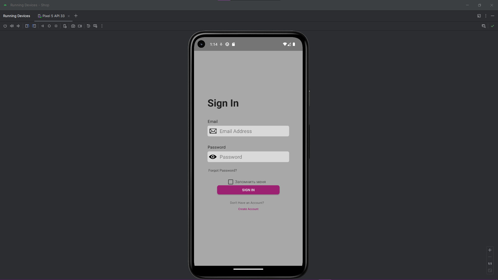
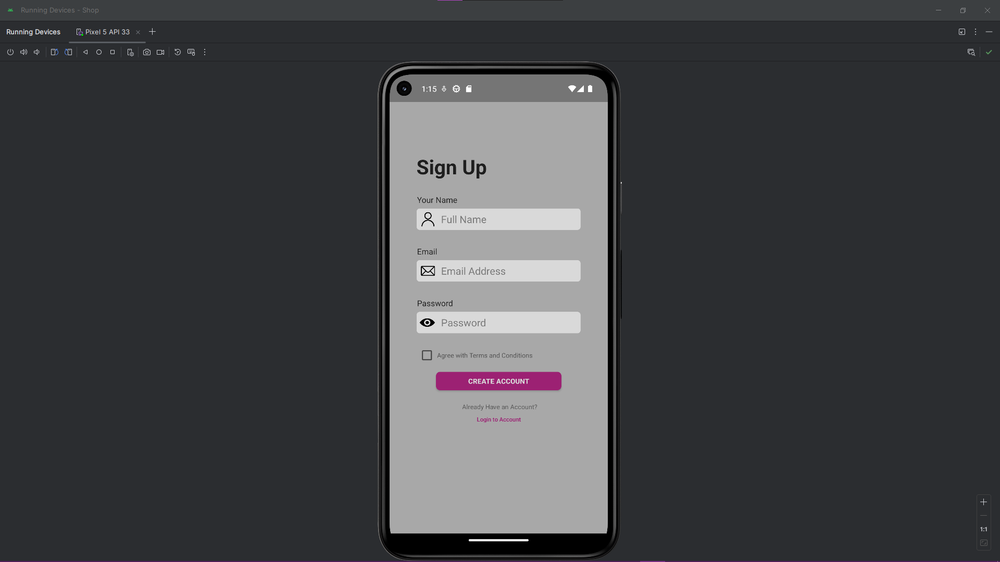
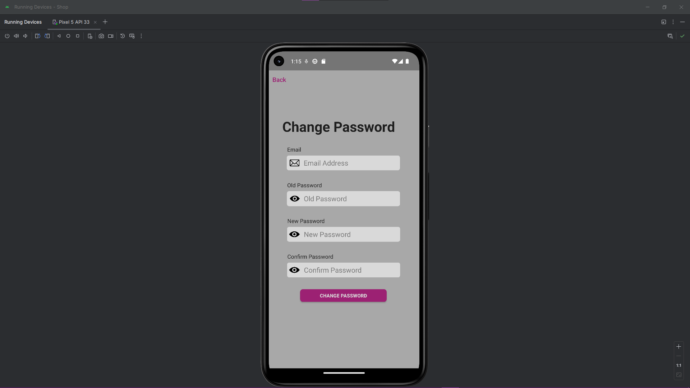
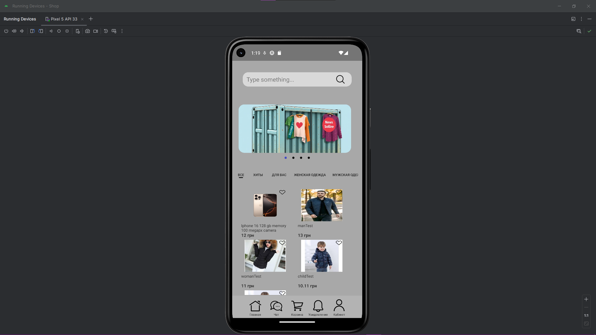
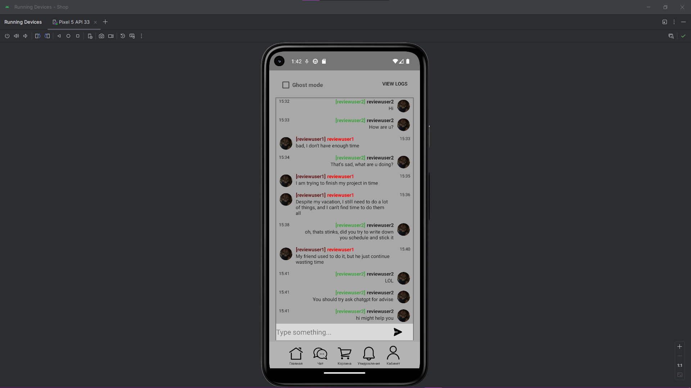

## Описание
Этот проект — мобильное приложение, разработанное мной для практики Java и изучения связанных технологий. Главная цель заключалась в улучшении навыков работы с Java, базами данных и API в процессе создания функционального прототипа. Работа над приложением велась в течение 1–1,5 месяцев.

Проект задумывался исключительно для учебных целей, поэтому особое внимание уделялось backend-части и API, а не эстетической составляющей пользовательского интерфейса.

## Технологии
- Java 17
- Spring Boot
- PostgreSQL
- Android Studio
- IntelliJ IDEA

## Реализованный функционал
Страница входа и регистрации.
Регистрация новых пользователей.
Возможность смены пароля.
Главная страница.

Чат:
Полностью рабочий функционал отправки и получения сообщений.

API и серверная часть:
Таблицы для хранения данных пользователей и сообщений.
Реализованы запросы для работы регистрации, входа и чата.

Фото реализованных функций:

Видео-обзор - https://youtu.be/eOmDkLJdV5A 
